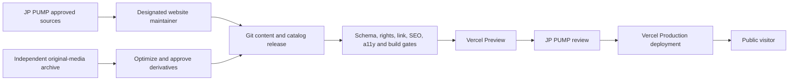
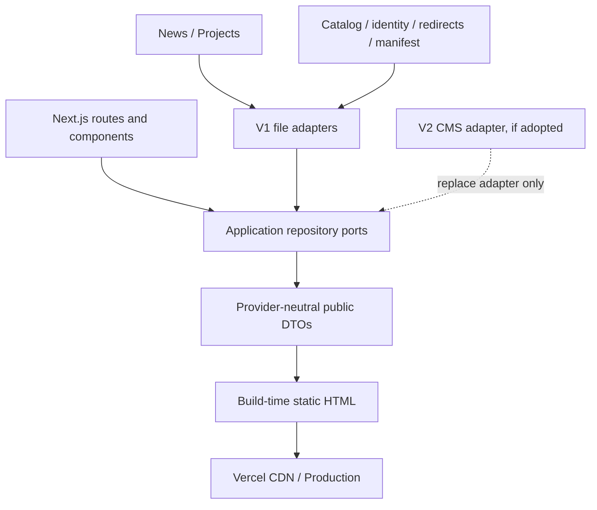
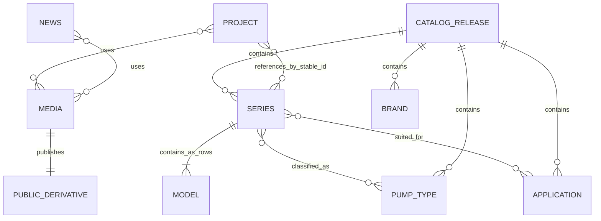

# Architecture Spine — JP-Website

## Design Paradigm

**[ADOPTED] Static-first content-as-code hexagonal modular frontend.** Next.js owns the public delivery surface. Version-controlled content and catalog releases enter through repository adapters, are projected into provider-neutral public DTOs, and become static HTML during a validated Vercel build. V1 has no application backend, CMS, database, administrator surface, management API, or recovery-email service.

Normal Next.js deployment on Vercel is retained instead of forcing `output: 'export'`. Public routes remain statically generated, but the project may use platform-supported redirects, security headers, default image optimization, Preview deployments, and deployment rollback without introducing an application data backend.



Domain and application modules must not import route, browser, Vercel, Markdown-parser, filesystem, or future CMS provider types. The composition root binds V1 file adapters; V2 may replace an adapter without changing page components or public DTO contracts.

## Invariants & Rules

### AD-1 — [ADOPTED] Next.js owns the public delivery surface

- **Binds:** FR-1..FR-17, FR-26..FR-36, NFR-1..NFR-4, NFR-8, NFR-12..NFR-13
- **Prevents:** a second frontend framework, duplicated routing, or client-only pages that drift from SEO and accessibility requirements
- **Rule:** Build public routes with the Next.js App Router. Server Components are the default and must be statically generated where their inputs are repository content. Client Components are limited to interactions requiring browser state. No parallel SPA shell, general client state store, or client data-fetch cache is permitted without a new architecture decision.

### AD-2 — [ADOPTED] V1 has no application backend

- **Binds:** all V1 capabilities
- **Prevents:** CMS, database, authentication, API, job queue, or mail infrastructure being added before a validated need exists
- **Rule:** V1 contains public Next.js routes, build-time content adapters, validation and release tooling only. It may use Vercel build, CDN, image, redirect, header, analytics, monitoring, Preview and rollback capabilities, but it must not introduce CMS administration, persistent application writes, database connections, administrator sessions, management APIs, transactional SMTP, or server-side forms.

### AD-3 — [ADOPTED] Git is the sole V1 publication authority

- **Binds:** FR-3..FR-5, FR-18..FR-28, UJ-4, UJ-5, NFR-10..NFR-12
- **Prevents:** JSX, spreadsheets, local folders, Preview deployments, or external drives becoming competing public sources of truth
- **Rule:** One reviewed Git commit owns each Production release. Markdown or an equivalent non-executable text format owns News and Projects; structured release data owns taxonomy, approximately 10 series pages, approximately 603 model rows, partners, corporate/contact facts, redirects and Hero content; a media manifest owns public asset references. Page components render DTOs and may not embed a second authoritative copy. Raw Excel, source documents and original media are evidence inputs, not runtime authorities.

### AD-4 — [ADOPTED] Publication is an immutable atomic deployment

- **Binds:** FR-18..FR-25, UJ-4, UJ-5, NFR-7, NFR-10..NFR-11
- **Prevents:** partially updated pages, unreproducible spreadsheet changes, and rollbacks that restore only part of a release
- **Rule:** Every candidate release records schema version, content hash, source references, dispositions, maintainer and review state. CI validates the complete snapshot and produces one Preview. Production changes only by promoting an approved build from a named commit. Removal or archive is another complete release with redirect/404 treatment. Rollback points the production domain to a prior known-good deployment.

### AD-5 — [ADOPTED] No V1 administrative surface exists

- **Binds:** FR-18..FR-21, NFR-5, NFR-10
- **Prevents:** an undocumented `/admin`, preview editor, mutable API, credential store or hidden database recreating a backend by accident
- **Rule:** Content changes require authorized Git and Vercel workflows. Preview URLs are not content-authoring tools and must be protected or unindexed. Client self-service publishing, roles, passwords, recovery, draft APIs and content mutation are V2 concerns and cannot be introduced as isolated shortcuts.

### AD-6 — [ADOPTED] Evidence and media require promotion before public use

- **Binds:** FR-2..FR-4, FR-14, FR-20..FR-21, FR-24, NFR-4, NFR-11, NFR-13
- **Prevents:** raw, unlicensed, sensitive, draft or AI-atmosphere assets being shipped as approved evidence
- **Rule:** Originals and rights evidence remain in an independently backed-up private source archive with stable ID, checksum, source, rights state and approval state. Only approved optimized derivatives enter immutable public paths and the media manifest. AI atmosphere is typed separately and cannot satisfy Project or product-evidence fields. A referenced public derivative is removed only through a reviewed release.

### AD-7 — [ADOPTED] Stable identity is separate from display names and URLs

- **Binds:** FR-6..FR-14, FR-17, FR-22..FR-35, NFR-10..NFR-12
- **Prevents:** rename-driven broken relationships, duplicate Series pages, analytics drift, and unit or missing-value ambiguity
- **Rule:** Entities use immutable opaque IDs; each locale owns a separate mutable slug. Timestamps cross boundaries as ISO 8601 UTC. Technical decimals are decimal strings paired with an explicit unit enum. Missing data is `null` and renders `未提供`; zero is a reviewed value only. Public DTOs exclude source evidence, reviewer identity, internal status and unpublished records.

### AD-8 — [ADOPTED] Locale availability controls route existence

- **Binds:** FR-26, FR-28..FR-29, NFR-12
- **Prevents:** unreviewed machine translation, empty English pages, and future URL migration
- **Rule:** Every public route is locale-prefixed. V1 generates only `/zh-tw/`; `/en/` does not exist until the relevant content is independently reviewed and published. Root requests permanently redirect to `/zh-tw/`. Locale content and slugs are explicit records, never fallback copies.

### AD-9 — [ADOPTED] URL query state is the catalog filter authority

- **Binds:** FR-2, FR-6..FR-9, FR-27..FR-31, UJ-1, NFR-2
- **Prevents:** home and catalog filters disagreeing, share/reload loss, incompatible OR/AND rules, and unbounded crawl spaces
- **Rule:** Parse filter parameters through one shared schema. Repeated values are normalized, sorted and deduplicated; values within a dimension use OR and dimensions use AND. The committed URL state drives results, counts, restoration and analytics. Listing/filter code loads only Series-level search metadata, not all model specifications. Filtered/search/sorted URLs emit `noindex,follow` and stay out of the sitemap.

### AD-10 — [ADOPTED] The promoted release owns all public SEO state

- **Binds:** FR-27..FR-33, NFR-1, NFR-7, NFR-9..NFR-10
- **Prevents:** Preview content in search, stale sitemaps, false 200 responses, generic home redirects and release components disagreeing
- **Rule:** Metadata, JSON-LD, internal links, redirects, robots directives and sitemap entries derive from the same validated Production content bundle. Clean indexable routes are self-canonical. Removed content receives a permanent nearest-target redirect only when a mapping exists; otherwise it produces a useful 404. No runtime revalidation is required in V1; a new content state is a new atomic deployment.

### AD-11 — [ADOPTED] Models are rows inside approximately 10 Series pages

- **Binds:** FR-10..FR-14, FR-25, UJ-3, NFR-1..NFR-3
- **Prevents:** 603 duplicate product pages, inaccessible virtualization, missing browser-find results and client hydration of thousands of cells
- **Rule:** A Series has one route and contains its Model rows. HS has approximately 12 rows; the combined SB/SBI/SBN Series page has approximately 491 rows and is the required extreme fixture. Render all reviewed rows as semantic, non-hydrated server HTML. Only the labelled table container may scroll horizontally. Pagination or virtualization requires a new UX and architecture decision proving that browser find, accessibility and SEO remain acceptable.

### AD-12 — [ADOPTED] Vercel is the V1 production envelope

- **Binds:** all public FRs, NFR-1, NFR-5, NFR-7, NFR-9..NFR-10
- **Prevents:** unmanaged servers, environment drift, commercial use on an ineligible plan and Preview replacing Production without review
- **Rule:** Connect the authoritative Git repository to a Vercel project on a commercially eligible plan. Pull requests/branches create Preview deployments; only an approved deployment from the production branch or an explicit promotion serves the purchased domain. Production, Preview and Development use isolated analytics and secrets. Public optimized assets ship with the deployment until measured repository/deployment growth justifies a separate object store.

### AD-13 — [ADOPTED] Content contracts remain backend-neutral

- **Binds:** FR-18..FR-26 and the V2 migration path
- **Prevents:** React pages importing filesystem layouts today or Payload/WordPress/Wix response types tomorrow
- **Rule:** Application ports expose `ContentRepository`, `CatalogRepository` and `MediaRepository` behavior returning explicit public DTOs. V1 adapters read validated files at build time. A future CMS adapter must satisfy the same contracts; provider records are mapped at the boundary. Product catalog data is not moved into a database merely because V2 introduces a CMS.

### AD-14 — [ADOPTED] V1 recovery is release-based and media-aware

- **Binds:** FR-22..FR-25, NFR-7, NFR-9..NFR-10
- **Prevents:** treating the current laptop, current deployment or Git alone as a complete backup
- **Rule:** Preserve Git history, approved Vercel Production deployments, release manifests, domain configuration documentation and an off-device/off-provider copy of original media and rights evidence. Document deployment promotion, rollback and domain recovery. Exercise a recovery drill before launch and at least quarterly. There is no database backup or restore path in V1.

### AD-15 — [ADOPTED] Security and privacy fail closed without blocking browsing

- **Binds:** FR-17, FR-34..FR-36, NFR-5..NFR-6, NFR-9
- **Prevents:** leaked secrets, public Preview indexing, PII in analytics and analytics consent becoming a functional dependency
- **Rule:** Enforce HTTPS, security headers, MFA and least privilege on Git/Vercel/domain/analytics accounts, server-only secrets, dependency scanning and redacted logs. Preview is `noindex` and access-protected when it contains unapproved evidence. Browser analytics loads only through a consent-aware `TelemetryPort`; denying it leaves navigation, filtering, phone and Email operational. Events contain stable IDs/enums, never contact values or free text.

### AD-16 — [ADOPTED] Design tokens and accessible primitives are shared contracts

- **Binds:** all public FRs, NFR-2..NFR-4, NFR-8, NFR-13
- **Prevents:** teams inventing incompatible colors, spacing, focus, dropdown, dialog, disclosure or responsive behavior
- **Rule:** Semantic CSS custom properties transcribe `DESIGN.md` and are the token authority. Tailwind may compose only those tokens and approved layout scales. Native HTML is preferred. Add a headless interaction library only for a measured accessibility gap requiring managed focus, overlays or composite controls; it is not a default dependency.

### AD-17 — [ADOPTED] Release gates exercise the real risk cases

- **Binds:** all, especially NFR-1..NFR-11
- **Prevents:** a build passing while catalog integrity, media rights, accessibility, indexing or dense-data behavior is broken
- **Rule:** A candidate must pass type/lint/build, content and catalog schemas, stable-ID/slug uniqueness, rights/alt checks, redirect/link/sitemap checks, dependency review and Playwright journeys in Chromium, WebKit and Firefox. Automated axe, 320 CSS px, reduced-motion, missing-data, no-consent, 404/redirect, Preview isolation, rollback and approximately 491-row cases are mandatory. WCAG acceptance also includes manual keyboard and screen-reader review.

## Consistency Conventions

| Concern | Convention |
| --- | --- |
| Modules and files | Feature/module directories use `kebab-case`; React components and domain types use `PascalCase`; functions and variables use `camelCase`; route files follow Next.js conventions. |
| Editorial content | News and Projects use one non-executable Markdown-equivalent document per item plus schema-validated frontmatter. JSX is never an authoritative content store. |
| Governed data | Catalog, partners, company/contact, redirects and media manifests use versioned structured data validated before build. Raw Excel/CSV is intake, not public runtime data. |
| Entity IDs | Immutable opaque string ID; never regenerated from a name or slug. Relationships store IDs only. |
| Locale and slugs | BCP 47 lowercase route key (`zh-tw`); one slug per locale; retired slugs require redirect or explicit 404 treatment. |
| Dates and time | ISO 8601 UTC timestamps at boundaries; date-only content uses `YYYY-MM-DD`; display formatting is locale-owned. |
| Technical values | Decimal string + governed unit enum; `null` means unavailable; no implicit conversions, inferred ranges, em-dash missing values or unitless numbers. |
| Public DTOs | Explicit allowlist projection from domain/application data; never expose parser, filesystem, spreadsheet or future CMS records directly. |
| Filter query | Repeated `brand`, `type` and `use` keys; optional `q` and governed `sort`; normalize, deduplicate and sort before evaluation. |
| Analytics events | Lower `snake_case` stable names with event version, page/content type, stable content ID, filter enums and consent state only. |
| Logs | Structured and redacted; no contact data, content bodies, source documents or tokens. |
| Configuration | Validate environment variables at build/start. Browser-exposed variables are an explicit allowlist. |
| Publication | Git commit → automated gates → Vercel Preview → human approval → Production promotion; no other mutation path. |

## Stack Seed

Versions were reality-checked on 2026-07-21. Exact versions are locked during scaffolding; upgrades require the same gates as a release.

| Layer | Seed |
| --- | --- |
| Runtime/tooling | Node.js 24.17.0 LTS; pnpm 11.15.1; TypeScript version proven by the current Next.js scaffold |
| Frontend | Next.js 16.2.10; React/React DOM 19.2.7; App Router |
| Styling | Tailwind CSS 4.3.3 composing semantic CSS custom properties from `DESIGN.md` |
| Validation | Zod 4.4.3 plus domain validators for catalog, rights, URLs and release invariants |
| Editorial source | Non-executable Markdown-equivalent files with schema-validated frontmatter; exact parser selected during scaffold |
| Governed source | Versioned JSON/TypeScript release data; Excel/CSV allowed only as validated intake |
| Testing | Playwright 1.61.1; `@axe-core/playwright` 4.12.1; manual keyboard and screen-reader review |
| Hosting | Vercel, commercially eligible plan; Pro is the current candidate |
| Source/release | GitHub repository with protected production branch and Preview deployments |
| Public media | Approved optimized derivatives shipped with the deployment; external object storage deferred until measured need |
| Analytics | GA4 through a consent-aware adapter; Search Console for indexing data |
| Explicitly absent in V1 | Payload, WordPress, Wix, Neon/Postgres, ORM, authentication, admin UI, management API, SMTP, runtime content writes |

## Structural Seed

```text
JP-Website/
  src/
    app/
      [locale]/              # public static-first routes and metadata
    modules/
      catalog/               # Series/Model domain, filtering and public DTOs
      content/               # News/Project domain, repositories and public DTOs
      identity/              # company, partner, contact and locale content
      seo/                   # metadata, JSON-LD, sitemap, robots and redirects
      telemetry/             # consent-aware browser events and observability ports
      media/                 # manifest and source-to-derivative policy
      shared/                # IDs, dates, errors and cross-module primitives only
    adapters/
      files/                 # V1 Markdown/structured-data repository implementations
    design-system/           # DESIGN.md tokens and approved public primitives
  content/
    news/                    # one validated editorial file per item
    projects/                # one validated editorial file per item
  data/
    catalog/
      releases/              # immutable normalized catalog snapshots
      active-release.json    # one reviewed release pointer
    identity/                # company, partners, contact and Hero content
    redirects.json
    media-manifest.json
  public/
    media/                    # approved optimized web derivatives only
  schemas/                   # versioned machine-readable input contracts
  tools/
    content/                 # validate, diff and release editorial content
    catalog/                 # intake, normalize, diff, validate and release catalog
    media/                   # checksum, optimize, approve and inventory derivatives
  tests/
    contracts/               # ownership, DTO, URL, rights and release invariants
    e2e/                     # public and maintainer release journeys
    fixtures/                # HS 12-row, SB/SBI/SBN 491-row, VBSG, missing and rights-block cases
  docs/
    operations/              # content update, deployment, rollback, domain and media recovery
```





## Capability → Architecture Map

| Capability / Area | Lives in | Governed by |
| --- | --- | --- |
| FR-1..FR-5 — trust and public content | `[locale]`, `identity`, `content`, `design-system` | AD-1, AD-3, AD-6, AD-10, AD-16 |
| FR-6..FR-14 — catalog discovery and technical data | `catalog`, `[locale]`, `data/catalog` | AD-4, AD-7, AD-9, AD-11, AD-17 |
| FR-15..FR-17 — contact and attribution | `identity`, `telemetry`, `[locale]` | AD-7, AD-15, conventions |
| FR-18..FR-21 — content-as-code publication | `content`, `data`, `media`, `tools/content`, file adapters | AD-2..AD-6, AD-10, AD-12..AD-14, AD-17 |
| FR-22..FR-25 — controlled product maintenance | `tools/catalog`, `data/catalog/releases`, contract tests | AD-3..AD-4, AD-7, AD-11, AD-14, AD-17 |
| FR-26 and NFR-12 — multilingual foundation | `[locale]`, locale contracts in governed modules | AD-8 |
| FR-27..FR-33 — crawl, URLs, sitemap and structured data | `seo`, public route metadata, redirects | AD-8..AD-10 |
| FR-34..FR-36 — analytics and privacy degradation | `telemetry` | AD-9, AD-15 |
| NFR-1..NFR-4 — performance, responsive, accessibility, motion | `[locale]`, `design-system`, E2E gates | AD-1, AD-11, AD-16, AD-17 |
| NFR-5..NFR-10 — security, recovery and operations | provider accounts, CI, Vercel, `docs/operations` | AD-4..AD-5, AD-12, AD-14..AD-17 |
| NFR-11..NFR-13 — integrity, locale and visual trust | domain DTOs, media manifest, design system | AD-3, AD-6..AD-8, AD-16 |

## Deferred

- **V2 backend/CMS/database:** revisit only after V1 reveals a validated need for non-engineer self-service publishing, forms, members, CRM, realtime data or other runtime writes. Compare Payload and managed headless WordPress against the existing ports; Wix remains conditional. Do not move product data into a database by default.
- **Exact Markdown parser and frontmatter package:** select during scaffold after verifying current Next.js/React compatibility. Content must remain non-executable and schema-validated regardless of library.
- **TypeScript exact version:** bind the compiler proven by the generated Next.js project and CI; do not select it independently from scaffold compatibility.
- **Commercial Vercel plan and account ownership:** confirm plan eligibility, billing owner, MFA, recovery owner and company handoff before attaching the production domain.
- **Public asset threshold:** keep optimized derivatives in the deployment until measured Git/deployment size, build time or cache needs justify object storage/CDN. Original/rights assets never depend on this choice.
- **Formal taxonomy and model columns:** JP PUMP technical review owns the controlled pump types, applications, Series mappings and Model fields before catalog schema v1 freezes.
- **Foreign brands, corporate facts, partner claims, contact values and media rights:** remain release blockers, not architecture gaps.
- **Consent, browser error, RUM and external uptime providers:** select after privacy review and budget confirmation; ports, redaction, degradation and independent monitoring are fixed.
- **Original-media archive provider:** select and document before production content work; it must be independently backed up and transferable.
- **Domain registrar/DNS provider:** user will purchase the domain; registrar choice is operational. Document ownership, recovery and DNS changes before launch.
- **491-row fallback:** pagination is revisited only if the production-shaped table fails measured performance/accessibility gates; virtualization is not an automatic fallback.
- **English launch, contact form, CRM, public accounts, selection tools, pricing, inventory and commerce:** remain outside V1 and require new product plus architecture decisions.
- **Maintenance response time:** belongs to the maintenance agreement and operating runbook, not application architecture.
