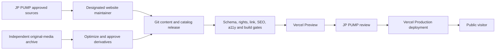
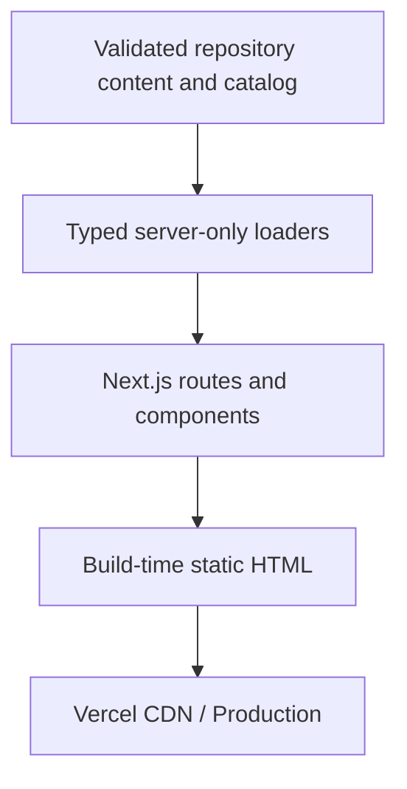
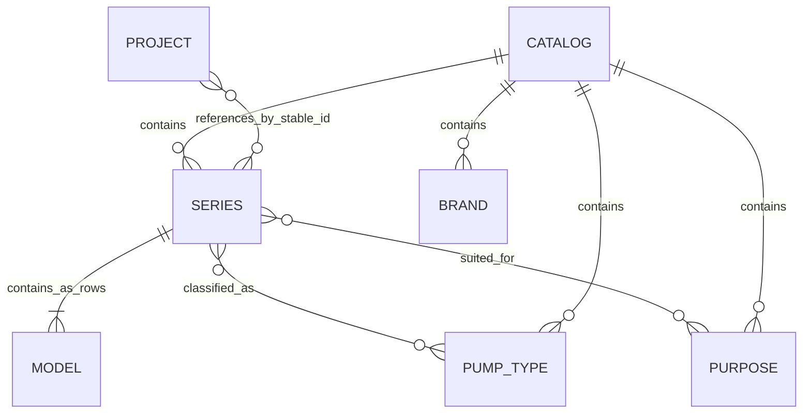

# Architecture Spine — JP-Website

## Design Paradigm

**[ADOPTED] Lean static-first Next.js App Router content site.** A clean official Next.js App Router scaffold owns the public delivery surface, Tailwind CSS composes the approved JP PUMP visual tokens, and version-controlled content becomes static HTML during a validated Vercel build. V1 has no application backend, CMS, database, administrator surface, management API, analytics runtime, or transactional email service.

The approved HTML mockups remain the visual reference, but the existing `website/` Vinext/Vite/Cloudflare/Drizzle starter is not an implementation baseline. Implementation will port the approved appearance and interactions into a clean Next.js project instead of adapting that starter.

Normal Next.js deployment on Vercel is retained instead of forcing `output: 'export'`. Public routes remain statically generated, but the project may use platform-supported redirects, security headers, default image optimization, Preview deployments, and deployment rollback without introducing an application data backend.



Route components use small typed server-only loaders that validate repository files and return page-ready data. No repository-port, provider-neutral projection layer, adapter, ORM, or future-CMS abstraction is required until a real second provider or runtime write path exists.

## Confirmed V1 Scope Overrides

These user-confirmed decisions supersede the older PRD/UX statements until those source documents are reconciled:

- Remove Latest Information/News from V1, including its routes, content model and home-page surface.
- Retain standalone Pump Type landing pages in V1. Brand and Purpose remain governed Series metadata and Product overview filters, but do not have standalone public routes.
- Keep approved Project summaries and evidence on Services & Projects, but defer individual Project detail pages.
- Retain the `/zh-tw/` locale prefix and redirect the root route to it.
- Defer GA4, contact attribution, cookie consent, RUM and third-party uptime monitoring.
- Replace the current `website/` starter during implementation with a clean official Next.js App Router scaffold and Tailwind CSS, while porting the approved visual results.

## Invariants & Rules

### AD-1 — [ADOPTED] Next.js owns the public delivery surface

- **Binds:** retained public-route capabilities after the confirmed scope overrides; NFR-1..NFR-4, NFR-8, NFR-12..NFR-13
- **Prevents:** a second frontend framework, duplicated routing, or client-only pages that drift from SEO and accessibility requirements
- **Rule:** Build public routes with the Next.js App Router. Server Components are the default and must be statically generated where their inputs are repository content. Client Components are limited to interactions requiring browser state. No parallel SPA shell, general client state store, or client data-fetch cache is permitted without a new architecture decision.

### AD-2 — [ADOPTED] V1 has no application backend

- **Binds:** all V1 capabilities
- **Prevents:** CMS, database, authentication, API, job queue, or mail infrastructure being added before a validated need exists
- **Rule:** V1 contains public Next.js routes, typed server-only content loaders, validation scripts and release tooling only. It may use Vercel build, CDN, image, redirect, header, Preview and rollback capabilities, but it must not introduce CMS administration, persistent application writes, database connections, administrator sessions, management APIs, transactional SMTP, server-side forms, analytics or RUM.

### AD-3 — [ADOPTED] Git is the sole V1 publication authority

- **Binds:** retained V1 public content and catalog capabilities, UJ-4, UJ-5, NFR-10..NFR-12
- **Prevents:** JSX, spreadsheets, local folders, Preview deployments, or external drives becoming competing public sources of truth
- **Rule:** One reviewed Git commit owns each Production release. Structured repository files own Brand/Pump Type/Purpose taxonomy data, Pump Type landing pages, approximately 10 canonical Series pages, approximately 603 Model rows, projects shown inside Services & Projects, partners, corporate/contact facts, redirects and Hero content. Brand and Purpose have no standalone public routes. Page components may not embed a second authoritative copy. Raw Excel, source documents and original media are evidence inputs, not runtime authorities. Latest Information/News and individual Project detail pages are absent from V1.

### AD-4 — [ADOPTED] Publication is an immutable atomic deployment

- **Binds:** retained publication and product-maintenance capabilities, UJ-4, UJ-5, NFR-7, NFR-10..NFR-11
- **Prevents:** partially updated pages, unreproducible spreadsheet changes, and rollbacks that restore only part of a release
- **Rule:** CI validates the complete repository state and produces a Preview tied to a named source commit. JP PUMP reviews that Preview; merging or promoting the approved commit creates Production, which may rebuild using Production environment settings. Removal or archive is another reviewed commit with redirect/404 treatment. Rollback points the production domain to a prior known-good deployment.

### AD-5 — [ADOPTED] No V1 administrative surface exists

- **Binds:** retained content maintenance capabilities, NFR-5, NFR-10
- **Prevents:** an undocumented `/admin`, preview editor, mutable API, credential store or hidden database recreating a backend by accident
- **Rule:** Content changes require authorized Git and Vercel workflows. Preview URLs are not content-authoring tools and must be protected or unindexed. Client self-service publishing, roles, passwords, recovery, draft APIs and content mutation are V2 concerns and cannot be introduced as isolated shortcuts.

### AD-6 — [ADOPTED] Evidence and media require promotion before public use

- **Binds:** FR-2..FR-4, FR-14, FR-20..FR-21, FR-24, NFR-4, NFR-11, NFR-13
- **Prevents:** raw, unlicensed, sensitive, draft or AI-atmosphere assets being shipped as approved evidence
- **Rule:** Originals and rights evidence remain in an independently backed-up private source archive with source, rights and approval notes. Only approved, web-optimized derivatives enter `public/media` with useful filenames and required alt/source/rights metadata. AI atmosphere is labelled separately and cannot satisfy Project or product-evidence fields. Checksums and a full media graph are optional unless duplication or scale creates a measured need.

### AD-7 — [ADOPTED] Stable identity is separate from display names and URLs

- **Binds:** FR-6..FR-14, FR-22..FR-33, NFR-10..NFR-12
- **Prevents:** rename-driven broken relationships, duplicate Series pages, and unit or missing-value ambiguity
- **Rule:** Relational entities use stable IDs that do not change when labels or slugs change; readable IDs are acceptable. Each locale owns a separate mutable slug. Timestamps cross boundaries as ISO 8601 UTC. Technical decimals are decimal strings paired with an explicit unit enum. Missing data is `null` and renders `未提供`; zero is a reviewed value only. Public page data excludes source evidence, reviewer identity, internal status and unpublished records.

### AD-8 — [ADOPTED] Locale availability controls route existence

- **Binds:** FR-26, FR-28..FR-29, NFR-12
- **Prevents:** unreviewed machine translation, empty English pages, and future URL migration
- **Rule:** Every public route is locale-prefixed. V1 generates only `/zh-tw/`; `/en/` does not exist until the relevant content is independently reviewed and published. Root requests permanently redirect to `/zh-tw/`. Locale content and slugs are explicit records, never fallback copies.

### AD-9 — [ADOPTED] URL query state is the catalog filter authority

- **Binds:** FR-2, FR-6..FR-9, FR-27..FR-31, UJ-1, NFR-2
- **Prevents:** home and catalog filters disagreeing, share/reload loss, incompatible OR/AND rules, and unbounded crawl spaces
- **Rule:** Parse `brand`, `type`, `purpose` and optional `q` through one shared schema. Brand accepts zero or one valid value; if an external URL supplies multiple or invalid Brand values, discard the Brand constraint and normalize the UI to `全部` rather than choosing arbitrarily. Repeated Pump Type and Purpose values are normalized and deduplicated. Pump Type selections use OR; Purpose selections use AND; dimensions combine with AND. The URL restores filters, results and counts. Brand and Purpose exist only as governed metadata and Product overview filter state; neither generates a standalone public page. The statically generated Server Page must not read `searchParams`; a small Client Component under `Suspense` reads and updates query state while receiving validated Series-level metadata, not full Model specifications. Sorting is absent. Home/Header shortcuts and catalog interactions may intentionally link to query URLs, but no combinatorial query-link grid is generated; query variants stay out of the sitemap, use the clean Product overview as canonical, and are not treated as separate indexable pages.

### AD-10 — [ADOPTED] The promoted release owns all public SEO state

- **Binds:** FR-27..FR-33, NFR-1, NFR-7, NFR-9..NFR-10
- **Prevents:** Preview content in search, stale sitemaps, false 200 responses, generic home redirects and release components disagreeing
- **Rule:** Metadata, basic Organization/Breadcrumb JSON-LD, internal links, redirects, robots directives and sitemap entries derive from the same validated Production repository state. Clean indexable routes are self-canonical. Removed content receives a permanent nearest-target redirect only when a mapping exists; otherwise it produces a useful 404. Query state restores the UI but is not promised a query-specific server-rendered `noindex` response. No runtime revalidation is required in V1.

### AD-11 — [ADOPTED] Models are rows inside approximately 10 Series pages

- **Binds:** FR-10..FR-14, FR-25, UJ-3, NFR-1..NFR-3
- **Prevents:** 603 duplicate product pages, inaccessible virtualization, missing browser-find results and client hydration of thousands of cells
- **Rule:** A Series has one route and contains its Model rows. HS has approximately 12 rows; the combined SB/SBI/SBN Series page has approximately 491 rows and is the required extreme fixture. Render all reviewed rows as semantic, non-hydrated server HTML. Only the labelled table container may scroll horizontally. Pagination or virtualization requires a new UX and architecture decision proving that browser find, accessibility and SEO remain acceptable.

### AD-12 — [ADOPTED] Vercel is the V1 production envelope

- **Binds:** all public FRs, NFR-1, NFR-5, NFR-7, NFR-9..NFR-10
- **Prevents:** unmanaged servers, environment drift, commercial use on an ineligible plan and Preview replacing Production without review
- **Rule:** The outer `JP-Website` Git repository is the sole repository. Implementation replaces the contents of `/website` with the clean Next.js application, removes the nested repository boundary in a reviewed migration, and configures Vercel Root Directory as `website`. Use a commercially eligible Vercel plan. Branches create Preview deployments; only an approved commit on the production branch or an explicit promotion serves the purchased domain. Preview and Development are `noindex`; secrets are isolated by environment. Public optimized assets ship with the deployment until measured growth justifies separate object storage.

### AD-13 — [ADOPTED] V1 content access stays direct and typed

- **Binds:** retained V1 content publication and catalog maintenance capabilities
- **Prevents:** speculative ports, adapters and projection layers making a small static site harder to understand
- **Rule:** Small server-only loaders read schema-validated repository files and return explicit typed page data. Routes do not parse raw Excel or import unpublished evidence. A future CMS or second provider triggers a new architecture decision and only then justifies an adapter boundary; product data is not moved into a database by default.

### AD-14 — [ADOPTED] V1 recovery is release-based and media-aware

- **Binds:** FR-22..FR-25, NFR-7, NFR-9..NFR-10
- **Prevents:** treating the current laptop, current deployment or Git alone as a complete backup
- **Rule:** Preserve Git history, known-good Vercel Production deployments, domain configuration documentation and an off-device copy of original media and rights evidence. Verify deployment rollback and domain recovery before launch and after major ownership changes. There is no database backup or quarterly recovery-drill program in V1.

### AD-15 — [ADOPTED] Security and privacy fail closed without blocking browsing

- **Binds:** NFR-5..NFR-6, NFR-9; analytics requirements deferred from V1
- **Prevents:** leaked secrets, public Preview indexing and unnecessary privacy/compliance machinery
- **Rule:** Enforce HTTPS, sensible security headers, MFA and least privilege on Git/Vercel/domain accounts, server-only secrets where any exist, dependency review and redacted build logs. Preview is `noindex` and access-protected when it contains unapproved evidence. V1 ships without GA4, contact attribution, cookie consent, RUM or third-party uptime monitoring. Search Console may be connected after launch without adding browser tracking.

### AD-16 — [ADOPTED] Design tokens and accessible primitives are shared contracts

- **Binds:** all public FRs, NFR-2..NFR-4, NFR-8, NFR-13
- **Prevents:** teams inventing incompatible colors, spacing, focus, dropdown, dialog, disclosure or responsive behavior
- **Rule:** Tailwind CSS is the adopted styling utility layer and composes semantic CSS custom properties transcribed from `DESIGN.md`, which remain the visual token authority. Native HTML and small local components are preferred. No separate component framework or headless library is added by default; add one only for a demonstrated accessibility gap that local code cannot safely cover.

### AD-17 — [ADOPTED] Release gates exercise the real risk cases

- **Binds:** all retained V1 capabilities, especially NFR-1..NFR-11 as reconciled
- **Prevents:** a build passing while catalog integrity, media rights, accessibility, indexing or dense-data behavior is broken
- **Rule:** Each candidate passes type/lint/build, content and catalog schemas, stable-ID/slug uniqueness, required alt/source/rights checks, and internal-link/sitemap checks. A focused Chromium smoke suite covers core navigation, filters, image interaction and the approximately 491-row Series fixture. Before launch and after major UI changes, manually verify mobile layouts, keyboard/focus behavior, reduced motion, useful 404s, Preview isolation and Safari. Broader browser, automated axe and screen-reader suites are added only when risk or regressions justify them.

## Consistency Conventions

| Concern | Convention |
| --- | --- |
| Modules and files | Feature/module directories use `kebab-case`; React components and domain types use `PascalCase`; functions and variables use `camelCase`; route files follow Next.js conventions. |
| Editorial content | Company, Service, taxonomy and Project summaries use schema-validated JSON; long prose may use non-executable Markdown only when useful. Latest Information/News and individual Project articles are not V1 content types. |
| Governed data | Catalog, Brand/Pump Type/Purpose taxonomy data, Pump Type landing pages, partners, company/contact, redirects and media metadata use JSON validated by Zod before build. Executable TypeScript is not a content authority. Raw Excel/CSV is intake, not public runtime data. |
| Excel catalog intake | The repeatable importer fully replaces `catalog.generated.json` with Excel-owned technical Series/Model fields and reports sheet/row/field errors. It never writes stable IDs, slugs, taxonomy mappings, approved display copy or image references; those live in `catalog-content.json`. Validation joins both files by stable Series/Model keys and fails on duplicate, missing or orphaned records. |
| Entity IDs | Stable string ID; never regenerated solely from a mutable label or slug. Relationships store IDs only. |
| Locale and slugs | BCP 47 lowercase route key (`zh-tw`); one slug per locale; retired slugs require redirect or explicit 404 treatment. |
| Dates and time | ISO 8601 UTC timestamps at boundaries; date-only content uses `YYYY-MM-DD`; display formatting is locale-owned. |
| Technical values | Decimal string + governed unit enum; `null` means unavailable; no implicit conversions, inferred ranges, em-dash missing values or unitless numbers. |
| Page data | Typed, explicit loader results; never expose spreadsheet rows, internal review data or source evidence directly. |
| Filter query | Zero or one `brand`, repeated `type` and `purpose`, plus optional `q`; normalize and deduplicate. Type values use OR, purpose values use AND, and dimensions combine with AND. No sort parameter. |
| Analytics | No browser analytics, contact attribution, consent manager or RUM in V1. |
| Logs | Structured and redacted; no contact data, content bodies, source documents or tokens. |
| Configuration | Validate environment variables at build/start. Browser-exposed variables are an explicit allowlist. |
| Publication | Git commit → automated gates → Vercel Preview → human approval → Production promotion; no other mutation path. |

## Stack Seed

Versions were reality-checked on 2026-07-21. Exact versions are locked during scaffolding; upgrades require the same gates as a release.

| Layer | Seed |
| --- | --- |
| Runtime/tooling | Node.js 24 LTS; pnpm 11.15.1; TypeScript version generated and proven by the clean official Next.js scaffold |
| Frontend | Next.js 16.2.10; React/React DOM 19.2.7; App Router |
| Styling | Tailwind CSS 4.3.3 composing semantic CSS custom properties from `DESIGN.md` |
| Tailwind integration | `@tailwindcss/postcss` in `postcss.config.mjs`; one global `@import "tailwindcss"`; CSS-first semantic tokens; no legacy v3 directives, separate autoprefixer, Sass/Less/Stylus, or JavaScript config by default |
| Validation | Zod 4.4.3 plus focused checks for catalog relationships, rights metadata, URLs and cross-record consistency |
| Editorial source | Schema-validated JSON or non-executable Markdown where prose length makes it useful; no MDX requirement |
| Governed source | JSON validated by Zod; Excel/CSV allowed only through the repeatable validated intake script |
| Testing | Next build/type/lint plus schema/link checks; focused Playwright 1.61.1 Chromium smoke; manual prelaunch mobile, keyboard, reduced-motion and Safari checks |
| Hosting | Vercel, commercially eligible plan; Pro is the current candidate |
| Source/release | GitHub repository with protected production branch and Preview deployments |
| Public media | Approved optimized derivatives shipped with the deployment; external object storage deferred until measured need |
| Analytics | None in V1; Search Console may be connected after launch |
| Browser floor | Tailwind 4 modern baseline: Chrome 111+, Safari 16.4+, Firefox 128+; hover-only behavior is enhancement and all actions remain usable by touch/keyboard |
| Explicitly absent in V1 | Vinext, Vite, Cloudflare/Wrangler, Drizzle, Payload, WordPress, Wix, database, ORM, authentication, admin UI, management API, SMTP, runtime content writes, GA4, consent manager, RUM |

## Structural Seed

```text
JP-Website/
  website/                   # Vercel Root Directory; clean Next.js application
    src/
      app/
        [locale]/            # /zh-tw/ public static routes and metadata
        sitemap.ts
        robots.ts
      features/
        catalog/             # filtering, Series/Model presentation and components
        content/             # company, services/projects, partners and contact
        navigation/          # shared header/footer and route metadata
      lib/
        content/             # typed server-only file loaders
        validation/          # Zod schemas and cross-record checks
      components/            # small shared accessible UI components
      styles/                # semantic tokens and Tailwind entry styles
    content/
      pages/                 # company, service/project and contact copy
      taxonomy/              # Pump Type landing-page copy plus Brand/Purpose filter metadata
    data/
      catalog.generated.json # importer-owned technical Series/Model fields
      catalog-content.json   # manual stable IDs, slugs, taxonomy, copy and image refs
      identity.json          # company, partners, contact and Hero facts
      projects.json          # summaries displayed on Services & Projects
      redirects.json
    public/
      media/                  # approved optimized web derivatives
    scripts/
      import-catalog.*        # required repeatable Excel intake with sheet/row/field errors
      validate-content.*      # catalog joins, content, link and media checks
    tests/
      e2e/                    # focused public Chromium smoke journeys
      fixtures/               # representative and 491-row risk cases
    docs/
      operations/            # content update, deploy, rollback and domain handoff
```





## Capability → Architecture Map

| Capability / Area | Lives in | Governed by |
| --- | --- | --- |
| FR-1..FR-4 — trust and public content, amended to remove News and Project detail | `[locale]`, `features/content`, repository content | AD-1, AD-3, AD-6, AD-10, AD-16 |
| FR-6..FR-14 — catalog discovery and technical data | `features/catalog`, `[locale]`, `data/catalog.generated.json`, `data/catalog-content.json` | AD-4, AD-7, AD-9, AD-11, AD-17 |
| FR-15..FR-16 — direct contact | `features/content`, `[locale]` | AD-7, AD-15, conventions |
| FR-18, FR-20..FR-21 — content-as-code publication, amended after News and Project-detail removal | `content`, `data`, `public/media`, typed loaders | AD-2..AD-6, AD-10, AD-12..AD-14, AD-17 |
| FR-22..FR-25 — controlled product maintenance | `scripts`, generated technical data, manual catalog content, validation checks | AD-3..AD-4, AD-7, AD-11, AD-14, AD-17 |
| FR-26 and NFR-12 — multilingual foundation | `[locale]`, locale contracts in governed modules | AD-8 |
| FR-27..FR-33 — crawl, URLs, sitemap and structured data | App Router metadata, `sitemap.ts`, `robots.ts`, redirects | AD-8..AD-10 |
| FR-17 and FR-34..FR-36 — analytics/attribution | Deferred from V1 by user decision; no runtime module | AD-15 |
| NFR-1..NFR-4 — performance, responsive, accessibility, motion | `[locale]`, shared components/styles, focused tests | AD-1, AD-11, AD-16, AD-17 |
| NFR-5..NFR-10 — security, recovery and operations | provider accounts, CI, Vercel, `docs/operations` | AD-4..AD-5, AD-12, AD-14..AD-17 |
| NFR-11..NFR-13 — integrity, locale and visual trust | validated page data, media metadata, semantic tokens | AD-3, AD-6..AD-8, AD-16 |

## Deferred

- **Latest Information/News:** removed from V1. Reintroducing it requires a product decision about editorial ownership and update frequency, not a dormant route or schema.
- **Individual Project detail pages:** deferred. V1 shows approved Project summaries and evidence within Services & Projects only.
- **Analytics and monitoring:** GA4, contact attribution, consent tooling, RUM and third-party uptime monitoring are deferred. Search Console may be connected after launch.
- **V2 backend/CMS/database:** revisit only after V1 reveals a validated need for non-engineer self-service publishing, forms, members, CRM, realtime data or other runtime writes. Do not create provider ports in advance or move product data into a database by default.
- **Exact prose-file format:** use structured files by default; select a Markdown parser during implementation only if long prose makes it useful. Content remains non-executable and schema-validated.
- **TypeScript exact version:** bind the compiler proven by the generated Next.js project and CI; do not select it independently from scaffold compatibility.
- **Commercial Vercel plan and account ownership:** confirm plan eligibility, billing owner, MFA, recovery owner and company handoff before attaching the production domain.
- **Public asset threshold:** keep optimized derivatives in the deployment until measured Git/deployment size, build time or cache needs justify object storage/CDN. Original/rights assets never depend on this choice.
- **Formal taxonomy and model columns:** JP PUMP technical review owns the controlled pump types, applications, Series mappings and Model fields before catalog schema v1 freezes.
- **Foreign brands, corporate facts, partner claims, contact values and media rights:** remain release blockers, not architecture gaps.
- **Original-media archive provider:** select and document before production content work; it must be independently backed up and transferable.
- **Domain registrar/DNS provider:** user will purchase the domain; registrar choice is operational. Document ownership, recovery and DNS changes before launch.
- **491-row fallback:** pagination is revisited only if the production-shaped table fails measured performance/accessibility gates; virtualization is not an automatic fallback.
- **English launch, contact form, CRM, public accounts, selection tools, pricing, inventory and commerce:** remain outside V1 and require new product plus architecture decisions. The `/zh-tw/` prefix remains in V1.
- **Maintenance response time:** belongs to the maintenance agreement and operating runbook, not application architecture.
