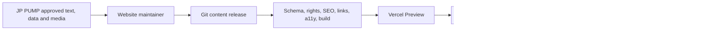

# JP-Website Static-first V1 架構審閱說明

## 已確認方向

V1 是以 Next.js 製作並部署至 Vercel 的 static-first 公司網站。所有最新資訊、建案實績、公司／合作夥伴內容、約 10 個產品系列頁、約 603 筆型號規格及核准後網站媒體，都由指定網站維護者透過 Git 更新。

V1 明確不建立：

- 後端與 runtime API
- CMS、管理後台與管理員登入
- 資料庫、ORM 或 persistent application writes
- 帳號復原 Email、server-side 表單、會員或 CRM

這份審閱不是要重新選 CMS；請確認此 static-first V1 是否具備可靠的內容結構、前端可用性、Vercel 發布流程及未來 V2 接入 CMS 的替換邊界。

## 資料量的正確理解

- 約 10 個產品系列各自只有一個詳細頁。
- 約 603 個 Model 是系列規格表中的資料列，不是 603 個產品頁。
- HS 約 12 列，共用一個 HS 系列頁。
- SB/SBI/SBN 合計約 491 列，共用一個系列頁，是效能與無障礙極端案例。
- VBSG 約 44 列，且橫跨多個泵浦類型，但仍只有一個系列頁。

## 候選實作基線

| 層級 | 建議 | 請審閱 |
| --- | --- | --- |
| Frontend | Next.js App Router、React、TypeScript | Server/Client Component 邊界與團隊能力 |
| Rendering | 正常 Vercel Next.js 部署；公開內容 build-time static generation | 不強制 `output: export` 是否合理 |
| Styling | Tailwind CSS 只組合 DESIGN.md semantic CSS variables | 是否已有更適合的團隊 design system |
| Accessible UI | Native HTML 優先；只有實測缺口才加入 React Aria 等 headless library | Dropdown、dialog、filter、table 的鍵盤行為 |
| News/Projects | 非 executable Markdown-equivalent + schema frontmatter | 格式、parser、安全與編輯體驗 |
| Catalog | 版本化 JSON/TypeScript release data；Excel/CSV 只作 intake | schema、diff、technical review、rollback |
| Validation | Zod + domain validators | 是否需 JSON Schema 或其他可共享 contract |
| Media | 原始檔獨立備份；核准最佳化衍生檔 + media manifest 進 deployment | repository 成長與未來 object storage threshold |
| Release | Git change → automated gates → Vercel Preview → JP PUMP review → Production promotion | branch protection、approval、rollback、ownership |
| Testing | Playwright + axe + manual keyboard/screen-reader review | QA 工具與真實裝置範圍 |
| Analytics | GA4 經 consent-aware adapter 載入 | consent 工具、事件 schema、無 consent 降級 |
| Monitoring | Vercel deployment/log visibility + external uptime + Search Console | 前端錯誤/RUM 供應商與通知責任 |
| Explicitly absent | Payload、WordPress、Wix、Neon、ORM、auth、SMTP、runtime writes | 是否有任何 V1 必要需求被漏掉 |

## 發布與資料流



## 內容與 UI 分離規則

```text
content/news/*.md
content/projects/*.md
data/catalog/releases/*
data/identity/*
data/redirects.json
data/media-manifest.json
public/media/*
```

- JSX/React components 不得保存第二份正式內容。
- File adapters 將來源映射成 public DTO；route/components 只讀 DTO。
- Stable ID 與 slug 分離，未來 CMS provider ID 不得成為公開契約。
- V2 若加入 CMS，只更換 `ContentRepository` adapter；產品 catalog 可繼續 Git-governed。

## 必須通過的主要風險案例

1. **491-row table：** 完整 semantic HTML、無 table hydration、手機容器水平捲動、全鍵盤可達、瀏覽器搜尋可找到所有型號。
2. **內容品質：** 重複 ID/slug、缺欄位、錯單位、未覆核技術值、未授權圖片、缺 alt text 必須阻止 Production。
3. **SEO：** sitemap、canonical、redirect、404、structured data 與畫面必須從同一 release 產生。
4. **Preview 隔離：** 未核准內容不被索引；Preview 不得意外取得 Production-only analytics。
5. **媒體：** 653 MB 原始來源不直接進公開部署；只交付核准且最佳化衍生檔，並保留可追溯 manifest。
6. **交接：** 第二位具網站維護能力的人可依文件完成內容更新、Preview、Production promotion 與 rollback。
7. **V2 遷移：** 未來接 Payload 或 managed WordPress 時，頁面、URL、SEO 與 catalog 不需要全面重寫。

## V2 原則，但不是 V1 工作

- 先以真實更新頻率確認是否需要非工程人員自助 CMS。
- News/Projects CMS 與產品 catalog 是不同決策；不預設一起進資料庫。
- 表單、會員、CRM 或 realtime data 出現時，再評估 custom backend。
- Payload、managed headless WordPress 與 Wix Headless 的舊比較保留在 architecture memlog 作歷史，不再是 V1 選型。

## 請用以下格式回覆

1. **結論：** Accept / Accept with changes / Reject
2. **Frontend：** 建議保留、移除或替換的工具
3. **Content model：** Markdown、catalog schema、DTO 與 stable ID 建議
4. **491-row table：** rendering、responsive、a11y 與效能建議
5. **Media：** source archive、optimization、manifest 與 storage threshold 建議
6. **Delivery：** Git、Vercel Preview、approval、Production 與 rollback 建議
7. **V2 readiness：** adapter boundary 是否足以避免重寫
8. **開發前必須關閉的風險：** 最多五項
